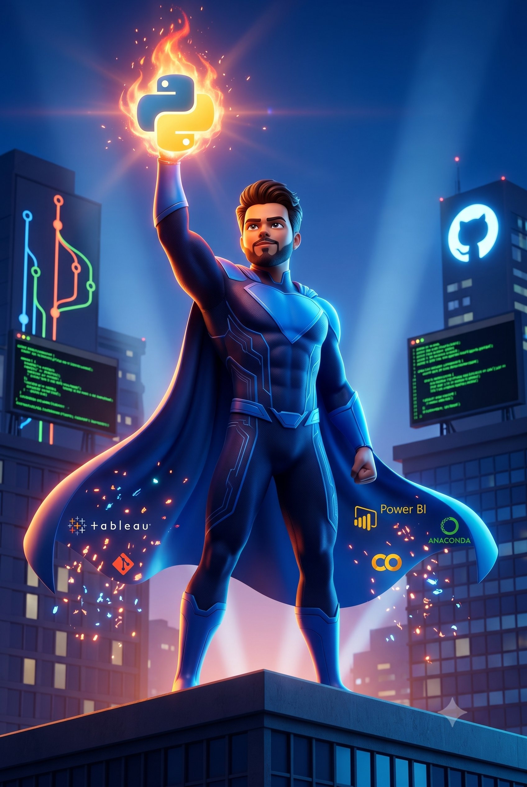

<div align="center">

<!-- ═══════════════════════════════════════════════ -->
<!--                  HERO SECTION                   -->
<!-- ═══════════════════════════════════════════════ -->


<!-- SOCIAL BADGES -->
<br/>

[](https://github.com/TusharChoudhury-29)
[](https://linkedin.com/in/tushar-choudhury-a44a05259/)
[](mailto:tusharchoudhury29@gmail.com)
[](#)

<br/>

<!-- TYPING ANIMATION -->
[](https://git.io/typing-svg)

</div>

---

<!-- ═══════════════════════════════════════════════ -->
<!--               ANIMATED HERO IMAGE               -->
<!-- ═══════════════════════════════════════════════ -->

<div align="center">
  
</div>

<br/>

---

<!-- ═══════════════════════════════════════════════ -->
<!--               ABOUT ME SECTION                  -->
<!-- ═══════════════════════════════════════════════ -->

<h2 align="center">⚡ About Me</h2>

```python
tushar = {
    "role"       : "Aspiring Data Scientist | Junior Analyst",
    "education"  : ["B.Tech ECE — VIT (2025)", "PG Program Data Science — Great Learning (Ongoing)"],
    "location"   : "Hyderabad, India  🇮🇳",
    "building"   : ["End-to-end ML Pipelines", "Business Analytics Dashboards", "Portfolio Projects"],
    "learning"   : ["Cloud Platforms (AWS/GCP)", "MLOps Fundamentals", "LLM & Prompt Engineering"],
    "ask_me"     : ["Python for Data Science", "EDA & Feature Engineering", "Tableau / Power BI"],
    "goal"       : "Land a Data Analyst / Data Science role and grow fast 🚀",
}
```

<br/>

---

<!-- ═══════════════════════════════════════════════ -->
<!--            CURRENTLY WORKING ON                 -->
<!-- ═══════════════════════════════════════════════ -->

<h2 align="center">🔭 Currently Working On</h2>

<div align="center">

| 🔬 Project | 📌 Stack | 🎯 Goal |
|---|---|---|
| Customer Churn Prediction | Python, XGBoost, Scikit-learn | End-to-end ML with business impact |
| Loan Default Risk Model | Python, LightGBM, Pandas | Financial domain ML case study |
| Car Insurance Claims Analysis | Tableau, Calculated Fields | Visual storytelling for stakeholders |
| E-Commerce Retail Analytics | Tableau, Power BI | Dashboard design for non-tech audience |

</div>

<br/>

---

<!-- ═══════════════════════════════════════════════ -->
<!--              SKILLS SHOWCASE                    -->
<!-- ═══════════════════════════════════════════════ -->

<h2 align="center">🛠️ Skills & Tech Stack</h2>

<h3 align="center">🐍 Languages & Core</h3>
<div align="center">

[](https://python.org)
[](https://www.mysql.com/)
[](https://www.r-project.org/)

</div>

<h3 align="center">📊 Data & Analytics</h3>
<div align="center">


</div>

<h3 align="center">🤖 Machine Learning</h3>
<div align="center">


</div>

<h3 align="center">☁️ Cloud & DevOps <em>(Learning)</em></h3>
<div align="center">

[](https://aws.amazon.com)
[](https://docker.com)
[](https://git-scm.com)
[](https://github.com)

</div>

<h3 align="center">🗄️ Databases</h3>
<div align="center">

[](https://postgresql.org)
[](https://mysql.com)
[](https://mongodb.com)

</div>

<h3 align="center">🧰 Tools & Environment</h3>
<div align="center">

[](https://code.visualstudio.com)
[](https://jupyter.org)
[](https://anaconda.com)
[](https://kernel.org)

</div>

<br/>

---

<!-- ═══════════════════════════════════════════════ -->
<!--            GITHUB ANALYTICS                     -->
<!-- ═══════════════════════════════════════════════ -->

<h2 align="center">📈 GitHub Analytics</h2>

<div align="center">


</div>

<div align="center">


</div>

<div align="center">


</div>

<br/>

---

<!-- ═══════════════════════════════════════════════ -->
<!--           ACTIVITY GRAPH                        -->
<!-- ═══════════════════════════════════════════════ -->

<div align="center">

[](https://github.com/TusharChoudhury-29)

</div>

---

<!-- ═══════════════════════════════════════════════ -->
<!--              PROFILE VIEWS + FOOTER             -->
<!-- ═══════════════════════════════════════════════ -->

<div align="center">


<br/><br/>


</div>
